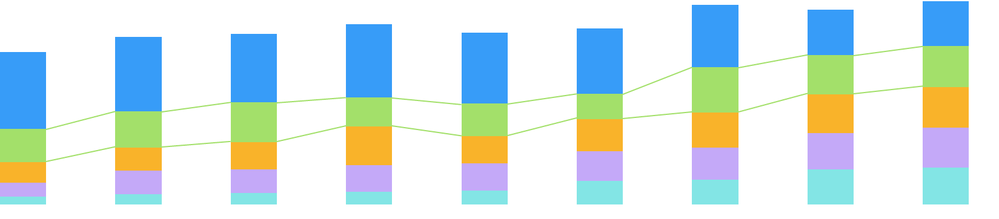

# react-stack
a stack bar to show data
[GitHub首页](http://www.github.com)
===================

初衷是想用react做一个用于多重展示数据的柱状图

update 2017/02/22
更新了一个效果的雏形，根据数据画出了柱状图，增加了hover效果连接柱状图间相同类别的数据体现对比效果。如图:

**待续**

update 2017/03/07
工作较忙，耽搁了几天。基本完成了自己想要实现的功能，但还有很多不如意的地方，比如接受的初始数结构不够简洁，而且代码中很多地方的效率并不高，有较多地方还需要优化。现在基本实现的效果是这样：

整个代码是使用react实现的，具体实现的方式代码中也有详细的注释，算是刚开始玩github,也不是很难，算是一个热身，希望以后与大家共同进步:)
